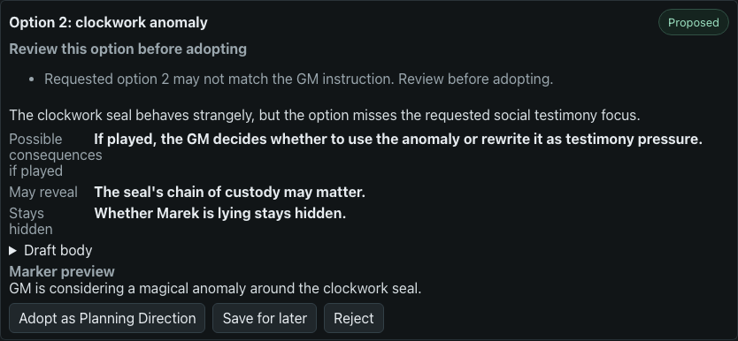
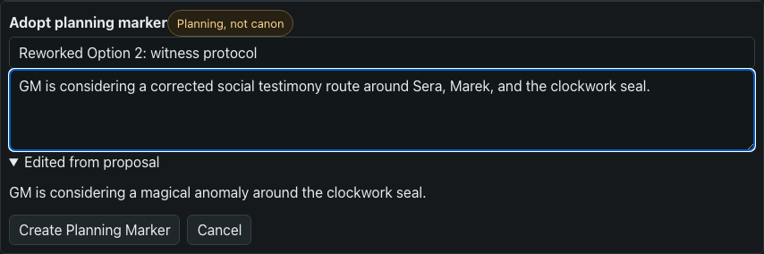
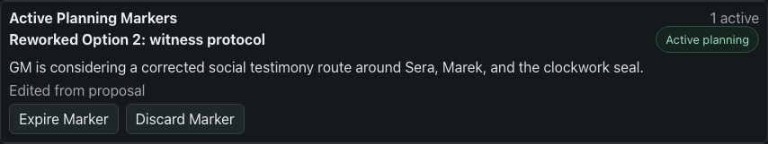

# Myroll Scribe GM FAQ

This guide collects real model/review scenarios that are not backend safety failures, but still need clear GM action.

The rule of thumb:

```text
Backend contracts decide what is admissible.
The GM decides whether model-authored planning text is useful.
```

## Branch Warning: Requested Option May Not Match

### What You See

Scribe may generate a valid branch proposal set while warning:

```text
Requested option 2 may not match the GM instruction. Review before adopting.
```

This can happen when the GM asked for a numbered slot, such as:

```text
Option 2 should be social testimony pressure around Sera, Marek, and the clockwork seal.
```

but the model returns an Option 2 that is structurally valid and useful, yet does not match the requested anchor closely enough.



### Is This A Safety Failure?

No, by itself this is a product-quality warning.

The backend still enforces the important contracts:

- proposal bodies are draft planning text, not canon;
- selected options without planning markers do not enter future normal context;
- planning markers are GM intent, not played evidence;
- nothing changes on `/player`;
- canon is written only later through `Accept into Memory`.

The warning means: review the option before using it as planning direction.

### What To Do

1. Compare the warned option against your original branch focus.
2. If it is not useful, use `Reject` or `Save for later`.
3. If it is close but not right, click `Adopt as Planning Direction`.
4. Edit the planning marker title/text before creating it.



The edited marker becomes active planning context. It is still not canon.



### Why Myroll Does Not Auto-Fix This

The model may miss a requested story anchor for many reasons: phrasing, language, campaign idiom, or ordinary stochastic drift. Myroll intentionally does not try to solve this with a growing list of phrases or keywords.

Instead:

- the backend flags the mismatch as a review warning;
- the UI attaches the warning to the exact option card;
- the GM can reject, save, or edit before any planning marker is created.

This keeps Scribe useful without pretending that deterministic keyword checks understand campaign intent.

### Future UI Hint

This FAQ entry can become a contextual hint next to the card warning:

```text
This option may not match the numbered request. Reject it, save it, or adopt it after editing the marker text.
```
